# HanaLoop PCF Dashboard

B2B 탄소관리 플랫폼(하나루프 Hana.eco)의 **PCF(제품탄소발자국, Product Carbon Footprint)** 대시보드입니다. 제품 1단위를 생산·유통하는 전 과정에서 발생하는 온실가스 배출량을 활동 데이터(전기·원소재·운송) × 배출계수로 산정하여, 경영자에게는 총량·추세·목표 진척을, 실무자에게는 정확한 입력·검증·드릴다운을 제공합니다. 도메인 개념은 [docs/DOMAIN.md](docs/DOMAIN.md)를 참조하세요.

**라이브 데모:** https://hanaloop-pcf-dashboard.vercel.app/dashboard

## 기술 스택

| 영역          | 선택                                                       |
| ------------- | ---------------------------------------------------------- |
| 언어          | TypeScript 5                                               |
| 프레임워크    | Next.js 16.2.6 (App Router) + React 19.2                   |
| 차트          | Recharts 3.8                                               |
| 스타일링      | Tailwind CSS v4 (`@theme` 토큰, `tailwind.config.ts` 없음) |
| 테스트        | Vitest 4                                                   |
| 패키지 매니저 | yarn 1.22.22 (corepack)                                    |
| 분석          | @vercel/analytics                                          |

> Tailwind v4·Next 16은 `create-next-app@latest` 기본 생성물 기준입니다. App Router 구조는 동일하며, Next 16은 `next lint`를 제거하여 `lint` 스크립트가 `eslint`로 동작합니다.

---

## 1. 로컬 실행 방법

```bash
git clone https://github.com/s-ja/hanaloop-pcf-dashboard.git
cd hanaloop-pcf-dashboard
corepack enable          # yarn 1.22.22 활성화
yarn install
yarn start               # = yarn build && next start, http://localhost:3000
```

- 개발 중에는 `yarn dev`(Turbopack HMR)를, 프로덕션 검증에는 `yarn build && yarn start`를 사용합니다.
- **http://localhost:3000 접속 시 `/dashboard`로 자동 리다이렉트**됩니다(`app/page.tsx`).
- 본 저장소는 yarn 단일 사용을 강제합니다. `package-lock.json`은 `.gitignore`로 차단되어 있으니 `npm install`을 실행하지 마세요(`yarn.lock`만 유지).

검증·스크립트 명령:

```bash
yarn lint    # ESLint (0 error / 0 warning)
yarn test    # Vitest 46건
yarn build   # 프로덕션 빌드 (TypeScript 통과 + prerender)
```

---

## 2. 시스템 설명 및 설계

### 2-1. 디렉토리 구조

```
hanaloop-pcf-dashboard/
├── app/                          # Next.js App Router
│   ├── layout.tsx                # 루트 레이아웃 + AppNav + 다크 모드 FOUC 방지 스크립트
│   ├── page.tsx                  # / → /dashboard 리다이렉트
│   ├── globals.css               # @theme 디자인 토큰(라이트/다크) + @custom-variant dark
│   ├── dashboard/page.tsx        # 대시보드 (경영자 중심, selectedPeriod·chartType 보유)
│   └── input/page.tsx            # 데이터 입력 (실무자 중심, addedActivities 보유)
│
├── components/
│   ├── dashboard/                # PCFSummaryCard, EmissionBreakdownChart,
│   │                             #   PCFTrendChart, GoalProgressBar, ActivityTable
│   ├── input/                    # ActivityInputForm, ActivityFormField
│   ├── shared/                   # AppNav, ScopeTag, UnitLabel,
│   │                             #   EmissionFactorBadge, PeriodFilter
│   └── ui/                       # Button, Card (UI 프리미티브)
│
├── lib/
│   ├── constants.ts              # 배출계수 4종 SSOT (EMISSION_FACTORS)
│   ├── mock-data.ts              # 과제 엑셀 활동 데이터(2025-01~08, 29건)
│   ├── pcf-calculator.ts         # PCF 계산 순수 함수 (전 단계 불변)
│   ├── validators.ts             # 입력값 검증
│   ├── format.ts                 # 숫자/단위/기간 포매팅
│   ├── input-helpers.ts          # 입력 폼 옵션 도출 (배출계수에서 파생)
│   ├── period-utils.ts           # 기간 비교/필터 옵션 유틸
│   └── dashboard-config.ts       # 표시 계층 설정(카테고리 색·순서·목표값)
│
├── hooks/
│   ├── usePCFData.ts             # 데이터 소스 추상화 (Phase 2 api-client 전환 대비)
│   └── usePCFCalculation.ts      # useMemo 기반 계산 결과 메모이제이션
│
├── types/index.ts                # 전체 도메인 타입 (Session 1 확정 후 불변)
│
├── tests/                        # Vitest 46건 (calculator/format/validators/period/input-helpers)
│
├── scripts/capture-baseline.mjs  # Playwright fullPage 스크린샷 캡처
│
└── docs/                         # 설계 문서 + baseline 스크린샷
    ├── DOMAIN.md  USER_RESEARCH.md  PLANNING.md  DESIGN_HANDOFF.md
    └── design/baseline/*.png
```

설계 원칙은 **계층 단방향 의존**입니다: `types → lib → hooks → components → app`. 역방향 의존을 두지 않으며, 이 규칙이 아래 데이터 흐름과 단계별 무변경 보장의 기반이 됩니다([docs/PLANNING.md](docs/PLANNING.md) 3장).

### 2-2. 데이터 흐름

```
mock-data ──┐
            ├─→ pcf-calculator ──→ hooks ──→ components ──→ pages
constants ──┘   (순수 함수)      (useMemo)   (표시 전용)    (상태 보유)
```

- `lib/constants.ts`의 `EMISSION_FACTORS`가 배출계수의 **Single Source of Truth**입니다. `mock-data`와 `pcf-calculator`(인자 주입)가 동일 출처를 참조합니다.
- 계산 로직은 컴포넌트 밖 `lib/pcf-calculator.ts`의 순수 함수에만 존재합니다(`calculatePCF` / `calculatePCFForPeriod` / `buildMonthlyTrend`).
- 상태는 페이지(`/dashboard`, `/input`)로 끌어올리고(Lift State Up), 컴포넌트는 가능한 한 stateless 표시 전용입니다.
- `usePCFData`가 데이터 소스를 추상화하여, Phase 2에서 내부만 `api-client`로 교체하면 컴포넌트·페이지는 변경 없이 동작합니다.

### 2-3. ERD

`PCFCalculationResult`는 활동 데이터로부터 런타임 계산되는 파생 산출물이므로 별도 테이블을 두지 않습니다. 아래 ERD는 영속 엔티티 3종으로, [types/index.ts](types/index.ts)의 `Product` / `ActivityData` / `EmissionFactor` 인터페이스와 1:1로 일치합니다.

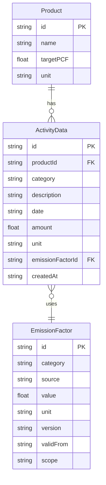

`EmissionFactor.scope`를 카테고리 하드코딩이 아닌 **레코드 단위**로 보유하는 것이 핵심 설계입니다. 운송처럼 동일 카테고리가 업스트림/다운스트림 양쪽일 수 있는 경우를 레코드 추가만으로 대응합니다([docs/DOMAIN.md](docs/DOMAIN.md) 2-2).

### 2-4. 단계별 변경 매트릭스 (Phase 1 → 2 → Bonus)

컴포넌트와 계산 로직은 **모든 단계에서 불변**입니다. 이것이 단계적 도입 설계의 핵심 trade-off 근거입니다([docs/PLANNING.md](docs/PLANNING.md) 4-3).

| 파일                    | Phase 1 (현재) | Phase 2 (API Routes)    | Bonus (DB)          |
| ----------------------- | -------------- | ----------------------- | ------------------- |
| `types/index.ts`        | ✅ 생성        | 🔒 불변                 | 🔒 불변             |
| `lib/constants.ts`      | ✅ 생성        | 🔒 불변                 | 🔒 불변             |
| `lib/mock-data.ts`      | ✅ 생성        | 🔒 불변 (API 내부 참조) | ❌ 제거 (DB 대체)   |
| `lib/pcf-calculator.ts` | ✅ 생성        | 🔒 불변                 | 🔒 불변             |
| `components/**`         | ✅ 생성        | 🔒 불변 (props 동일)    | 🔒 불변             |
| `lib/api-client.ts`     | ❌ 없음        | ✅ 생성                 | 🔒 불변             |
| `app/api/**/route.ts`   | ❌ 없음        | ✅ 생성                 | 🔄 내부 로직만 교체 |
| `prisma/schema.prisma`  | ❌ 없음        | ❌ 없음                 | ✅ 생성             |
| `docker-compose.yml`    | ❌ 없음        | ❌ 없음                 | ✅ 생성             |

---

## 3. AI 도구 사용 내역

본 과제는 분석 → 구현 → 디자인 → 통합을 서로 다른 AI 도구로 분담하고, 도구 간 컨텍스트는 레포의 `docs/*.md`와 `SESSION_LOG.md`로 공유했습니다([docs/PLANNING.md](docs/PLANNING.md) 8장).

| 도구                   | 역할                                        | 사용자 활용 양상 (핵심)                                                                                                                                                                                         |
| ---------------------- | ------------------------------------------- | --------------------------------------------------------------------------------------------------------------------------------------------------------------------------------------------------------------- |
| **Claude (분석 세션)** | 탄소 도메인·사용자·구현 전략 분석           | `docs/DOMAIN.md`·`docs/USER_RESEARCH.md`·`docs/PLANNING.md` 3종 작성. 코드 작성 전 도메인 개념(PCF/Scope/배출계수)과 페르소나를 서면으로 확정                                                                   |
| **Claude Code**        | 구현 전반(타입·계산·컴포넌트·페이지·테스트) | **5개 세션으로 분리** 진행하여 각 세션 종료 시 `SESSION_LOG.md`에 완료 파일·검증 결과·다음 세션 주의사항을 기록. 불변 제약(types/계산/상수)을 세션 간 전달하여 일관성 유지                                      |
| **Claude Design**      | 디자인 시스템 토큰화·다크 모드·반응형 시안  | `docs/DESIGN_HANDOFF.md`를 두 surface 간 공유 계약으로 사용. baseline 스크린샷을 첨부해 실제 데이터 밀도 기반으로 토큰(라이트/다크 쌍)·차트 색·모바일 레이아웃 시안을 산출, Claude Code가 props 무변경으로 통합 |

> 본 과제 범위상 프롬프트 본문이나 코드 수정 이력의 정제·보존은 포함하지 않습니다([docs/PLANNING.md](docs/PLANNING.md) 8-4).

---

## 4. 작업 소요 시간 및 시간이 많이 든 부분

전체 작업은 **2일(2026-05-25 ~ 05-26)** 에 걸쳐 진행했으며, 분석 세션(Phase 0)으로 설계 문서를 먼저 확정한 뒤 구현 5세션을 이어 수행했습니다.

| 일자  | 작업                                                | 산출물                       |
| ----- | --------------------------------------------------- | ---------------------------- |
| 사전  | 분석 세션 (Phase 0)                                 | docs 3종                     |
| 05-25 | Session 1 — 타입·상수·mock·계산기 + 회귀 테스트     | 기반 레이어, 5월 PCF 정합    |
| 05-25 | Session 2 — 공유 컴포넌트·UI 프리미티브·포매팅/검증 | shared/ui, format/validators |
| 05-25 | Session 3 — 대시보드 컴포넌트·페이지·라우팅         | /dashboard, 차트·드릴다운    |
| 05-25 | Session 4 — 입력 폼·검증·즉시 프리뷰                | /input, 에러 메시지          |
| 05-26 | Session 5 — 디자인 토큰 통합·다크 모드·차트 토큰화  | globals.css 토큰, 반응형     |

**시간이 많이 든 영역**

1. **도메인 분석** — PCF 산정 공식과 GHG Scope 1/2/3 매핑을 과제 데이터에 맞게 해석하고, 배출계수 버전 관리·5월 중복 행 처리 같은 결정을 코드 설계로 환원하는 데 가장 많은 사고가 필요했습니다.
2. **디자인 토큰 통합 + 다크 모드** — Tailwind v4 `@theme` 기반 라이트/다크 토큰 쌍을 14개 컴포넌트 props 무변경으로 적용하고, FOUC 없이 SSR/하이드레이션 안전하게 다크 토글을 구현하는 작업.
3. **Recharts 차트 토큰화** — 축·그리드·카테고리 색을 인라인 hex에서 CSS 변수로 옮겨 다크 모드 전환 시 변수 캐스케이드로 즉시 재색상되도록 한 작업.

---

기본 화면은 라이트 모드 기준입니다. 다크 모드 캡처는 동일 5종을 모두 확보해 두었으며, README 길이 절약을 위해 아래 접이식 블록(▶ 클릭)으로 제공합니다.

### 대시보드 (경영자 뷰)

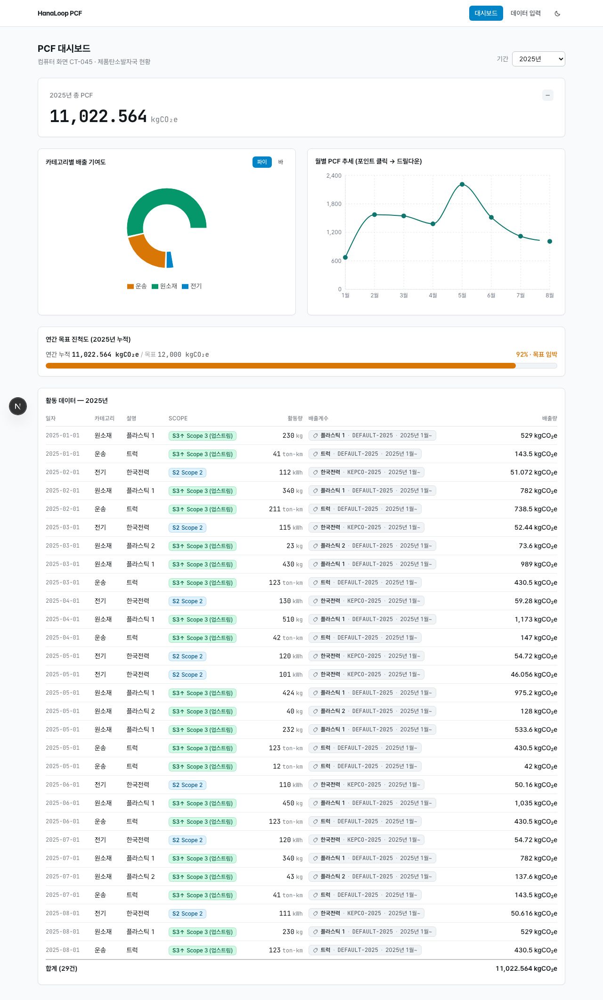
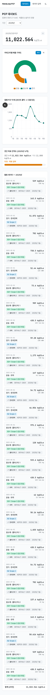
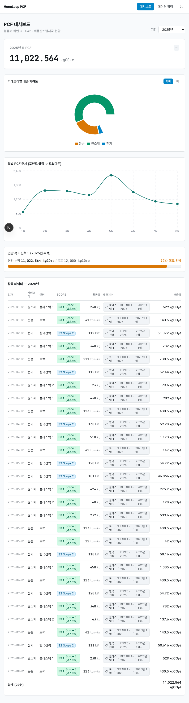

### 데이터 입력 (실무자 뷰)

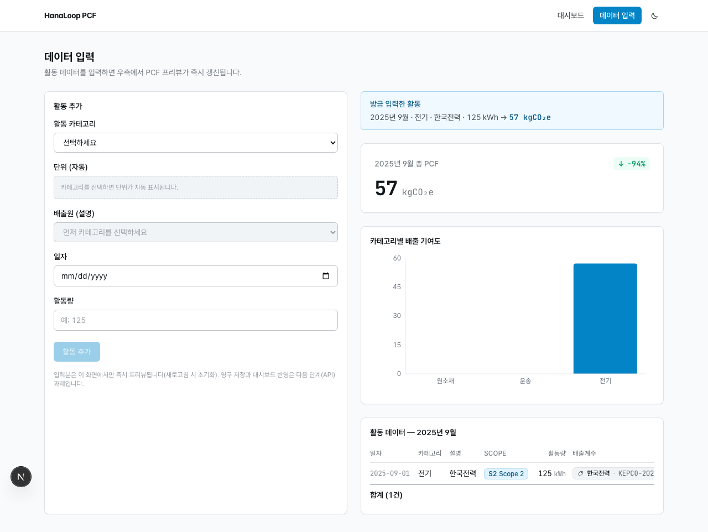
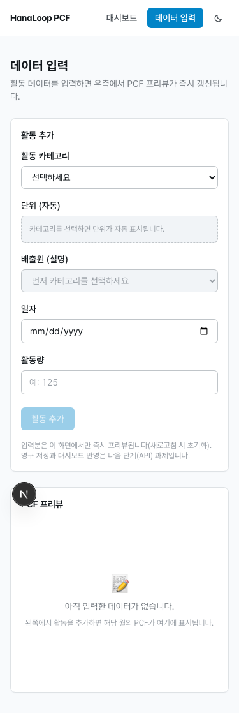

<details>
<summary>🌙 <b>다크 모드 스크린샷 보기</b> — 동일 5종 (클릭하여 펼치기)</summary>

<br />

**대시보드 (경영자 뷰)**

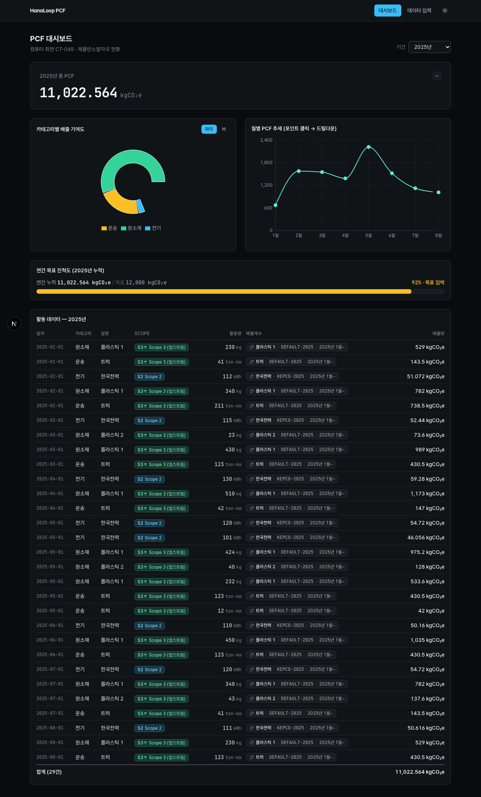
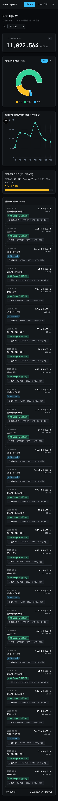
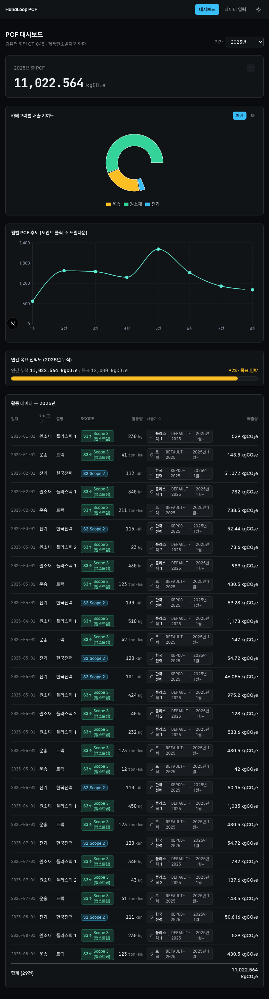

**데이터 입력 (실무자 뷰)**

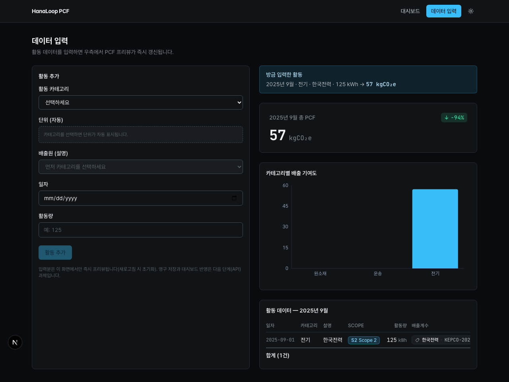
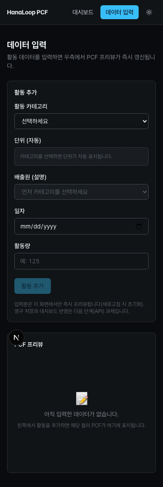

</details>

> 스크린샷은 `scripts/capture-baseline.mjs`(Playwright, fullPage)로 재캡처할 수 있습니다: `npx playwright install chromium` → `yarn dev` → `node scripts/capture-baseline.mjs`. 다크 모드 캡처는 `CAPTURE_DARK=1`을 붙입니다(라이트/다크 동시 생성).

---

## 6. 실행 비디오

[](https://youtu.be/joyh6NbI-yw)

> 위 썸네일을 클릭하면 YouTube에서 데모 영상이 재생됩니다 — https://youtu.be/joyh6NbI-yw

---

## 7. 향후 확장 방향

- **Phase 2 — API Routes 분리:** `app/api/{activities,emission-factors,pcf}/route.ts`와 `lib/api-client.ts`를 추가하고, `usePCFData` 내부의 mock 직접 참조를 fetch 호출로 교체합니다. 위 단계별 변경 매트릭스(2-4)대로 컴포넌트 props·계산 로직·타입은 무변경으로 전환되므로, 검증된 상태에서 안정적으로 클라이언트-데이터 계층을 분리할 수 있습니다.
- **다년간 비교 대응:** 현재 데이터는 2025년 단년이지만, `ActivityData.date`가 ISO 일자를 보존하므로 mock 추가만으로 다년 집계가 가능합니다. `calculatePCFForPeriod`는 `'YYYY'`/`'YYYY-MM'`을 모두 받고, `buildDashboardPeriodOptions`가 **데이터가 실제 존재하는 기간만** 필터에 노출하므로 새 연도 데이터가 자동 반영됩니다. 전년 동월 비교 카드는 기존 컴포넌트 변경 없이 새 컴포넌트로 분리 추가하는 것을 권장합니다.
- **Bonus 영역:** PostgreSQL + Prisma, Docker Compose 즉시 실행, Excel 임포트 API, 타 시스템(다중 제품) 비교는 시간 제약으로 미진행했습니다. 다만 `Product` 인터페이스의 다중 제품 구조와 단계별 변경 매트릭스에 따라 데이터 모델은 확장 가능한 형태로 설계를 완료해 두었습니다.

---

## 8. 추가 문서

- [docs/DOMAIN.md](docs/DOMAIN.md) — 탄소 회계·PCF·GHG Scope·배출계수 도메인 정리
- [docs/USER_RESEARCH.md](docs/USER_RESEARCH.md) — 실무자/경영자 페르소나 및 사용 시나리오
- [docs/PLANNING.md](docs/PLANNING.md) — 구현 전략·데이터 모델·디렉토리·trade-off
- [docs/DESIGN_HANDOFF.md](docs/DESIGN_HANDOFF.md) — 디자인 통합 핸드오프 계약(동결 props·토큰)
- [SESSION_LOG.md](SESSION_LOG.md) — 세션별 진행 상태 기록
