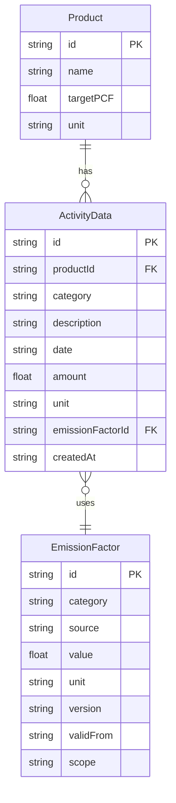

# PLANNING.md — 구현 전략 및 설계

> 본 문서는 (주)하나루프 프론트엔드 개발자 채용 과제의 구현 전략, 데이터 모델, 디렉토리 구조, 컴포넌트 설계, 그리고 설계 trade-off를 정리한 자료입니다.
> 
> 도메인 개념은 `DOMAIN.md`, 사용자 정의와 UX 결정은 `USER_RESEARCH.md` 를 전제로 합니다. 본 문서는 다음 두 목적을 함께 다룹니다.
> 
> - Claude Code 세션과 Claude Design 세션이 참조할 구현 설계 사양
> - 제출 결과물의 `docs/` 폴더에 포함되는 설계 근거 자료

---

## 1. 과제 요구사항 종합 정리

### 1-1. 필수 / 권장 / 보너스 구분 (체크리스트 기준)

|구분|항목|비고|
|---|---|---|
|**필수**|PCF 계산 결과가 시각화, 직관적으로 이해 가능|UX|
|**필수**|데이터 값이 정확하고 단위 표시 적절|UX|
|**필수**|데이터 입력 화면에서 오류 입력 시 에러 메시지 표시|UX|
|**필수**|UI 실행 비디오캡쳐 + 스크린샷|제출물|
|**필수**|README에 로컬 실행 5단계 이내 명확 기재, **`yarn start` 무오류 실행**|제출물|
|**필수**|README에 AI 도구 사용 내역 기록|제출물|
|**필수**|README에 시스템 전체 설명 + 설계 내용 포함|제출물|
|**필수**|GitHub 저장소 public + 단계별 커밋 히스토리|제출물|
|**권장**|ERD 또는 스키마 다이어그램이 README에 포함|설계 문서화|
|**권장**|발표에서 "왜 이렇게 설계했는가" 2개 이상 설명 가능|발표|
|**권장**|설계 trade-off 1개 이상 설명 가능|발표|
|**보너스**|Docker Compose로 즉시 실행 가능|인프라|
|**보너스**|이 Excel의 "과제용 데이터"를 그대로 임포트 가능|기능 확장|
|**보너스**|OpenAPI / Swagger 문서|기능 확장|
|**보너스**|타 시스템과 비교|기능 확장|

### 1-2. 기술 스택 (확정)

|영역|선택|근거|
|---|---|---|
|언어|TypeScript|과제 명시 요구|
|프레임워크|Next.js (App Router)|과제 명시 요구 + API Routes를 통해 단일 레포 구성|
|패키지 매니저|**yarn**|체크리스트 명시: `yarn start` 무오류 실행. `package-lock.json` 생성 방지|
|차트|Recharts|React 생태계 표준, 학습 곡선 낮음, 과제 기간 내 완성도 우선|
|스타일링|Tailwind CSS|Claude Design 출력과의 연계 용이|
|DB (보너스)|PostgreSQL + Prisma ORM|과제 Optional 명시. 보너스 단계에서만 도입|

### 1-3. 평가 기준 배점

|기준|배점|핵심 질문|
|---|---|---|
|시스템 설계|**30%**|API 활용 방식, 모듈형 컴포넌트 구조, 확장성·재사용성·안정성|
|도메인 이해|**25%**|탄소 회계 개념(PCF, GHG Scope)을 코드·설명에 반영했는가?|
|사용자 경험(UX)|**25%**|비전문가도 직관적으로 데이터 입력하고 결과를 읽을 수 있는가?|
|논리적 설명|**20%**|설계 결정 이유, trade-off, AI 활용 방식을 명확하게 설명 가능한가?|

---

## 2. 구현 단계 계획 (Phase 1 → 2 → Bonus)

### 2-1. 단계별 구현 범위

#### Phase 1 (필수) — mock-data.ts 기반 핵심 기능

**목표:** PCF 계산 로직 + 대시보드 시각화 + 데이터 입력 UI 완성

- `lib/constants.ts` — 배출계수 단일 선언 (Single Source of Truth)
- `lib/mock-data.ts` — 과제 엑셀 활동 데이터를 TypeScript 객체로 변환
- `lib/pcf-calculator.ts` — 순수 함수로 PCF 계산 로직 분리
- `types/index.ts` — 전체 도메인 타입 정의
- 컴포넌트에서 직접 `import { mockData } from '@/lib/mock-data'`
- `/dashboard`, `/input` 두 라우트 구현
- 핵심 차트·카드·폼 컴포넌트 구현

**완료 시점에 달성되는 것:**

- 체크리스트 필수 항목 8개 모두 충족
- 권장 항목인 "왜 이렇게 설계했는가", "trade-off 설명"의 서면 근거 확보 (본 PLANNING.md 6장)

#### Phase 2 (권장) — Next.js API Routes 추가

**목표:** 클라이언트와 데이터 계층 분리, 보너스 단계 전환 준비

**변경되는 부분:**

- `app/api/activities/route.ts` 신규 생성 — GET, POST
- `app/api/emission-factors/route.ts` 신규 생성 — GET
- `app/api/pcf/route.ts` 신규 생성 — 서버에서 계산 결과 반환
- `lib/api-client.ts` 신규 생성 — fetch 래퍼
- 컴포넌트에서 `mock-data` 직접 import → `apiClient.fetchActivities()` 호출로 변경
- mock-data.ts는 **삭제하지 않고** API Routes 내부에서만 참조

**유지되는 부분 (변경 없음):**

- `types/index.ts`
- `lib/pcf-calculator.ts` (순수 함수)
- `lib/mock-data.ts` (API Routes 내부에서만 사용)
- 모든 컴포넌트의 props 인터페이스

**추가 가능:**

- Swagger/OpenAPI 문서 (`swagger-jsdoc` 패키지) — 보너스 항목
- ERD를 README에 Mermaid로 포함 — 권장 항목

#### Bonus — PostgreSQL + Docker Compose + Excel 임포트

**목표:** 보너스 항목 충족

- `prisma/schema.prisma` 생성, 마이그레이션 실행
- `app/api/**/route.ts` 내부의 mock-data 참조를 Prisma 쿼리로 교체
- `docker-compose.yml` 생성 — PostgreSQL + Next.js 컨테이너
- Excel 임포트 API (`app/api/import/route.ts`) — 과제 엑셀을 그대로 받아 파싱
- 보너스 항목 "타 시스템과 비교"는 시간 여유 시 다중 제품 비교 화면으로 시도

**Bonus 단계에서도 컴포넌트와 계산 로직은 변경되지 않음** — 이것이 본 설계의 핵심 trade-off 결정의 근거입니다 (5장 참조).

### 2-2. 작업 단계 흐름

본 과제는 단일 인원·신규 도메인·일부 도구(Claude Design 등) 첫 사용을 포함하므로 구체적인 시간 추정보다 **작업 단계와 우선순위**만 정의합니다. Claude Code 세션은 이 흐름을 따르되 단계별 소요 시간에 제약받지 않고 유동적으로 진행합니다.

|순서|작업|우선순위|
|---|---|---|
|0|프로젝트 초기화, 디렉토리 구조 세팅, yarn 환경 확인|필수|
|1-A|타입 정의 + mock-data + pcf-calculator|필수|
|1-B|대시보드 핵심 컴포넌트 (Card, Chart, TrendChart)|필수|
|1-C|데이터 입력 폼 + 검증 + 에러 메시지|필수|
|1-D|Claude Design 활용 디자인 다듬기 + 통합|필수|
|1-E|README + 비디오캡쳐 + 스크린샷|필수|
|2|API Routes 전환 + Swagger 문서 + ERD|권장|
|Bonus|PostgreSQL + Docker Compose + Excel 임포트|선택|

**진행 원칙**

- Phase 1 (0~1-E) 완료를 최우선으로 함. 체크리스트 필수 항목을 모두 충족
- Phase 2는 Phase 1 완료 후 안정적으로 동작하는 상태에서 시작
- Bonus는 Phase 2까지 안정화된 이후 시간 여유에 따라 선택적으로 진행
- 디자인 디테일·문서 작업·신규 도구 학습 등 단계별 변수가 존재하므로 작업 시간 사전 추정에 따르기보다 우선순위 기준으로 진행 여부를 판단

---

## 3. 디렉토리 구조

Next.js App Router 기준. Phase 1 → Phase 2 → Bonus 전환 시 **컴포넌트 디렉토리와 타입은 변경되지 않도록** 설계합니다.

```
hanaloop-pcf-dashboard/
├── app/
│   ├── layout.tsx
│   ├── page.tsx                    # / → /dashboard 리다이렉트
│   ├── dashboard/
│   │   └── page.tsx                # 대시보드 메인 (경영자 중심)
│   ├── input/
│   │   └── page.tsx                # 데이터 입력 (실무자 중심)
│   └── api/                        # Phase 2 이후 생성
│       ├── activities/
│       │   └── route.ts            # GET, POST
│       ├── emission-factors/
│       │   └── route.ts            # GET
│       ├── pcf/
│       │   └── route.ts            # GET (서버 계산 결과)
│       ├── import/
│       │   └── route.ts            # Bonus: Excel 임포트
│       └── docs/
│           └── route.ts            # Bonus: Swagger UI
│
├── components/
│   ├── dashboard/
│   │   ├── PCFSummaryCard.tsx
│   │   ├── EmissionBreakdownChart.tsx
│   │   ├── PCFTrendChart.tsx
│   │   ├── GoalProgressBar.tsx
│   │   └── ActivityTable.tsx
│   ├── input/
│   │   ├── ActivityInputForm.tsx
│   │   └── ActivityFormField.tsx
│   ├── shared/
│   │   ├── ScopeTag.tsx
│   │   ├── UnitLabel.tsx
│   │   ├── EmissionFactorBadge.tsx
│   │   └── PeriodFilter.tsx
│   └── ui/                         # 공통 UI 프리미티브 (Button, Card 등)
│
├── lib/
│   ├── constants.ts                # 배출계수 SSOT
│   ├── mock-data.ts                # 과제 엑셀 데이터 (TS 변환)
│   ├── pcf-calculator.ts           # PCF 계산 순수 함수 (전 단계 불변)
│   ├── api-client.ts               # Phase 2 이후: fetch 래퍼
│   ├── format.ts                   # 숫자 포매팅, 단위 표시 유틸
│   └── validators.ts               # 입력값 검증
│
├── types/
│   └── index.ts                    # 전체 도메인 타입 (전 단계 불변)
│
├── hooks/
│   ├── usePCFData.ts               # 데이터 패칭/상태 관리
│   └── usePCFCalculation.ts        # 계산 결과 메모이제이션
│
├── tests/                          # 시간 허용 시
│   └── pcf-calculator.test.ts      # 5월 검증 케이스 등
│
├── docs/                           # 본 분석 문서 3종
│   ├── DOMAIN.md
│   ├── USER_RESEARCH.md
│   └── PLANNING.md
│
├── prisma/                         # Bonus 단계
│   └── schema.prisma
│
├── docker-compose.yml              # Bonus 단계
├── package.json
├── tailwind.config.ts
├── tsconfig.json
└── README.md
```

### 3-1. 디렉토리 설계 원칙

|원칙|적용|
|---|---|
|**계층 분리**|`types → lib → hooks → components → app` 순으로 의존. 역방향 의존 금지|
|**재사용성**|`components/shared/` 에 페르소나 공통 컴포넌트 배치|
|**확장성**|`app/api/` 는 Phase 1 에서는 비어있고, Phase 2부터 채워짐. 컴포넌트 영향 없음|
|**테스트 용이성**|`lib/pcf-calculator.ts` 가 순수 함수이므로 단위 테스트가 쉬움|

---

## 4. 데이터 모델

### 4-1. TypeScript 인터페이스

```typescript
// types/index.ts

/* ───────────────────────── 1. 기본 분류 ───────────────────────── */

/** 활동 카테고리 — 과제 데이터의 3대 카테고리 */
export type ActivityCategory = 'electricity' | 'material' | 'transport'

/** 한국어 카테고리 라벨 매핑 (UI 표시용) */
export const ActivityCategoryLabel: Record<ActivityCategory, string> = {
  electricity: '전기',
  material: '원소재',
  transport: '운송',
}

/** GHG Scope 분류 — DOMAIN.md 2-2 매핑 결정 기반 */
export type EmissionScope = 'scope1' | 'scope2' | 'scope3_upstream' | 'scope3_downstream'

/**
 * 활동 카테고리 → Scope 매핑은 카테고리 단위가 아닌 EmissionFactor 레코드 단위로
 * 결정합니다. 운송과 같이 동일 카테고리가 업스트림/다운스트림 양쪽에 해당될 수
 * 있는 경우, 각 EmissionFactor 레코드가 자신의 scope 값을 직접 보유합니다.
 *
 * 본 과제 데이터의 트럭 운송은 방향이 명시되어 있지 않아 업스트림으로 일괄
 * 부여합니다. 실제 환경에서는 운송 방향별로 별개 EmissionFactor 레코드를
 * 추가하여 대응 가능합니다 (DOMAIN.md 2-2 참조).
 */

/* ───────────────────────── 2. 배출계수 ───────────────────────── */

/** 배출계수 — DOMAIN.md 2-3 결정에 따라 version, validFrom 포함 */
export interface EmissionFactor {
  /** 고유 식별자: 예) 'EF_ELECTRICITY_KEPCO_2025' */
  id: string
  /** 활동 카테고리 */
  category: ActivityCategory
  /** 사용처/소스 표시명: 예) '한국전력', '플라스틱 1', '트럭' */
  source: string
  /** 계수값 */
  value: number
  /** 단위: 'kgCO2e/kWh' | 'kgCO2e/kg' | 'kgCO2e/ton-km' */
  unit: string
  /** 버전 식별자: 예) 'KEPCO-2025', 'DEFAULT-2025' */
  version: string
  /** 유효 시작일 (ISO date string) */
  validFrom: string
  /** GHG Scope 매핑 */
  scope: EmissionScope
}

/* ───────────────────────── 3. 활동 데이터 ───────────────────────── */

/** 사용자가 입력하는 원본 활동 데이터 */
export interface ActivityData {
  /** 고유 ID (생성 시 자동 부여) */
  id: string
  /** 제품 ID (현재 과제는 'CT-045' 단일) */
  productId: string
  /** 활동 카테고리 */
  category: ActivityCategory
  /** 활동 설명: '한국전력', '플라스틱 1', '플라스틱 2', '트럭' */
  description: string
  /** 활동 일자 (ISO date string, 일 단위까지 보존) */
  date: string
  /** 활동량 */
  amount: number
  /** 단위 — 카테고리별 고정값과 일치해야 함 */
  unit: string
  /** 연결된 배출계수 ID */
  emissionFactorId: string
  /** 생성 시각 */
  createdAt: string
}

/* ───────────────────────── 4. 제품 ───────────────────────── */

export interface Product {
  id: string
  name: string
  /** 경영자 목표 PCF값 (kgCO2e/단위) */
  targetPCF?: number
  /** 제품 단위: '개', 'kg', 'ton' */
  unit: string
}

/* ───────────────────────── 5. 계산 결과 ───────────────────────── */

/** PCF 계산 결과 — 카테고리별 + 합계 */
export interface PCFCalculationResult {
  productId: string
  /** 집계 기간 식별자: 'YYYY-MM' 또는 'YYYY' */
  period: string
  /** 카테고리별 배출량 (kgCO2e) */
  breakdown: {
    electricity: number   // Scope 2
    material: number      // Scope 3 업스트림
    transport: number     // Scope 3 업스트림
  }
  /** 총 PCF (kgCO2e) */
  totalPCF: number
  /** 사용된 배출계수 버전 목록 — UI 배지 표시 + 보고 추적성 */
  emissionFactorVersions: string[]
  /** 집계에 포함된 활동 데이터 개수 (드릴다운용) */
  activityCount: number
}

/** 시계열 트렌드 차트용 */
export interface PCFTrendPoint {
  period: string         // 'YYYY-MM'
  totalPCF: number
  breakdown: PCFCalculationResult['breakdown']
}
```

### 4-2. ERD (Mermaid — README 삽입용)



> PCFCalculationResult는 활동 데이터로부터 파생되는 계산 산출물이므로 별도 테이블로 두지 않고 런타임에 계산합니다(Bonus DB 단계에서도 동일 — 캐시 테이블이 필요해질 정도의 규모는 본 과제 범위 밖).

### 4-3. 단계별 파일 변경 매트릭스

|파일|Phase 1|Phase 2|Bonus|
|---|---|---|---|
|`types/index.ts`|✅ 생성|🔒 불변|🔒 불변|
|`lib/constants.ts`|✅ 생성|🔒 불변|🔒 불변|
|`lib/mock-data.ts`|✅ 생성|🔒 불변 (API 내부 참조)|❌ 제거 (DB로 대체)|
|`lib/pcf-calculator.ts`|✅ 생성|🔒 불변|🔒 불변|
|`components/**`|✅ 생성|🔒 불변 (props 동일)|🔒 불변|
|`lib/api-client.ts`|❌ 없음|✅ 생성|🔒 불변|
|`app/api/**/route.ts`|❌ 없음|✅ 생성|🔄 내부 로직만 교체|
|`prisma/schema.prisma`|❌ 없음|❌ 없음|✅ 생성|
|`docker-compose.yml`|❌ 없음|❌ 없음|✅ 생성|

**핵심 설계 원칙: 컴포넌트와 계산 로직은 모든 단계에서 불변.**

---

## 5. 핵심 컴포넌트 목록

### 5-1. 대시보드 컴포넌트 (`components/dashboard/`)

|컴포넌트|역할|주요 Props|
|---|---|---|
|`PCFSummaryCard`|총 PCF + 전기간 대비 증감 표시|`totalPCF: number`, `previousPCF: number`, `unit: string`, `period: string`|
|`EmissionBreakdownChart`|카테고리별 기여도 (파이/바)|`breakdown: PCFCalculationResult['breakdown']`, `chartType: 'pie' \| 'bar'`|
|`PCFTrendChart`|월별 시계열 라인 차트, 인터랙티브|`data: PCFTrendPoint[]`, `onPointClick?: (period: string) => void`|
|`GoalProgressBar`|목표 대비 진척도 게이지|`current: number`, `target: number`, `unit: string`|
|`ActivityTable`|활동 데이터 목록 (드릴다운용)|`activities: ActivityData[]`, `period?: string`|

### 5-2. 입력 컴포넌트 (`components/input/`)

|컴포넌트|역할|주요 Props|
|---|---|---|
|`ActivityInputForm`|전기/원소재/운송 활동 데이터 입력 + 검증|`emissionFactors: EmissionFactor[]`, `onSubmit: (data: Omit<ActivityData, 'id' \| 'createdAt'>) => void`|
|`ActivityFormField`|단일 입력 필드 + 검증 에러 표시|`label: string`, `error?: string`, `children: ReactNode`|

### 5-3. 공유 컴포넌트 (`components/shared/`)

|컴포넌트|역할|주요 Props|
|---|---|---|
|`ScopeTag`|Scope 2/3 라벨 배지 (툴팁 포함)|`scope: EmissionScope`|
|`UnitLabel`|단위 표시 (`kgCO₂e`, `kWh` 등)|`unit: string`|
|`EmissionFactorBadge`|배출계수 버전·출처 배지|`version: string`, `source: string`, `validFrom: string`|
|`PeriodFilter`|기간 선택 (월별/분기별/연간)|`selected: string`, `onChange: (period: string) => void`|

### 5-4. 컴포넌트 설계 원칙

- **Props는 최소·명시적으로** — `PCFCalculationResult` 같은 큰 객체보다 필요한 필드만 분해하여 받음 (단, 차트 컴포넌트는 객체 단위가 더 자연스러우면 객체 수용)
- **상태는 페이지 레벨로 끌어올림(Lift State Up)** — 컴포넌트는 가능한 한 stateless
- **데이터 로딩은 hooks로 분리** — `usePCFData`, `usePCFCalculation` 이 데이터 흐름을 담당, 컴포넌트는 표시만
- **shared 컴포넌트는 도메인 의존성 명확** — `ScopeTag` 등은 도메인 타입을 props로 받지만, 도메인 로직은 포함하지 않음 (표시 전용)

---

## 6. 설계 결정 및 Trade-off

본 장은 두 카테고리로 분리합니다.

- **Trade-off** — 두 선택지 모두 가치가 있는 상황에서 한쪽을 의식적으로 선택하고 다른 쪽을 미루거나 포기한 결정. 미래에 교체·확장 가능한 경로를 함께 명시
- **설계 결정** — 일반적으로 더 나은 방향이 명확한 best practice 또는 도메인 해석 결정. trade-off 가 아니지만 설계 근거로 문서화할 가치가 있는 항목

### 6-1. Trade-off — 단계적 도입 결정

#### 6-1-1. Phase 1에서 PostgreSQL 미사용, Bonus 단계 도입

|항목|내용|
|---|---|
|**선택**|Phase 1은 mock-data.ts 기반, Phase 2는 API Routes + mock-data, Bonus에서만 PostgreSQL|
|**미루는 것**|데이터 영속성, 실제 DB 환경에서의 검증|
|**우선 확보하는 것**|UI/계산 로직 완성도, 컴포넌트 layer 안정성|
|**교체·확장 경로**|`app/api/**/route.ts` 내부 로직만 교체하면 PostgreSQL 도입 가능. 컴포넌트와 계산 로직, 타입 인터페이스는 모두 무변경 (4-3 매트릭스 참조). 단계적 도입 구조이므로 검증된 상태에서 안정적으로 확장 가능|

#### 6-1-2. API Routes 채택, Express 미사용

|항목|내용|
|---|---|
|**선택**|Next.js 내장 API Routes|
|**미루는 것**|Express의 풍부한 미들웨어 생태계, 백엔드 독립 배포|
|**우선 확보하는 것**|단일 레포·단일 배포, 프론트엔드와 타입 공유(`types/index.ts`), Vercel 무료 배포 호환|
|**교체·확장 경로**|백엔드 규모 확장 시 Express 또는 NestJS 기반 별도 서버로 분리 가능. `lib/api-client.ts` 의 fetch URL만 외부 서버로 변경하면 클라이언트 영향 최소|

#### 6-1-3. Recharts 채택, D3.js 미사용

|항목|내용|
|---|---|
|**선택**|Recharts|
|**미루는 것**|D3.js 수준의 완전한 커스터마이징, 비표준 차트 표현력|
|**우선 확보하는 것**|React 컴포넌트로 즉시 사용, 표준 시각화(파이/바/라인) 빠른 완성|
|**교체·확장 경로**|차트 컴포넌트가 `components/dashboard/` 에 분리되어 있어, 특정 차트만 D3.js 또는 Visx 등으로 점진적 교체 가능. 차트 props 인터페이스를 유지하면 사용처 영향 없음|

### 6-2. 설계 결정 (Trade-off가 아닌 항목)

#### 6-2-1. 계산 로직을 lib/ 에 순수 함수로 분리

|항목|내용|
|---|---|
|**성격**|Best practice 결정. trade-off 가 아님|
|**결정**|`lib/pcf-calculator.ts` 에 순수 함수로 PCF 계산 로직 분리|
|**근거**|① 단위 테스트 가능성 ② 배출계수 버전 교체 시 단일 파일 수정으로 대응 ③ API Routes 도입 시 동일 함수를 서버에서 재사용 가능 ④ DOMAIN.md 3장의 "Single Source of Truth" 원칙과 일관|

#### 6-2-2. 동일 월 중복 데이터의 비합치 저장

|항목|내용|
|---|---|
|**성격**|도메인 해석 결정. trade-off 가 아님|
|**결정**|동일 `(date, category, description)` 조합에 유니크 제약 없음. 각 행을 별개 ActivityData로 저장, 집계 시 합산|
|**근거**|DOMAIN.md 4장에서 과제 데이터의 5월 중복 행(전기 101kWh, 원소재 232kg, 운송 12ton-km)을 "의도된 데이터"로 판단한 결정과 일치. 실무에서도 동일 월에 복수 발주·복수 활동이 발생 가능한 시나리오|

#### 6-2-3. EmissionFactor 레코드 단위로 Scope 부여

|항목|내용|
|---|---|
|**성격**|도메인 확장성 결정. trade-off 가 아님|
|**결정**|카테고리 → Scope 하드코딩 매핑 없이, 각 `EmissionFactor` 레코드가 자신의 scope 필드를 직접 보유|
|**근거**|운송과 같이 동일 카테고리가 업스트림/다운스트림 양쪽에 해당될 수 있는 경우, 레코드 단위 부여가 정확. 본 과제 데이터의 트럭 운송은 방향 명시가 없어 업스트림으로 일괄 부여하며, 실제 환경에서는 별개 레코드 추가로 대응 (DOMAIN.md 2-2, 4-1 인터페이스 주석 참조)|

---

## 7. 평가 기준별 대응 정리

### 7-1. 도메인 이해 (25%)

|어떤 결정이 도메인 이해를 반영하는가|
|---|
|`EmissionScope` 타입으로 Scope 2/3 명시적 구분 (DOMAIN.md 2-2)|
|`EmissionFactor.version`, `validFrom` 필드로 배출계수 버전 관리 개념 반영 (DOMAIN.md 2-3)|
|`PCFCalculationResult.emissionFactorVersions` 로 "어떤 계수 버전을 사용했는가" 결과에 포함|
|UI에 `ScopeTag` 컴포넌트로 Scope 라벨 노출|
|UI에 `EmissionFactorBadge` 로 사용된 계수의 출처·시점 표시|
|단위 표기 `kgCO₂e` 통일 (DOMAIN.md 2-1)|
|동일 월 중복 데이터를 합산값+개별값 양쪽으로 확인 가능 (DOMAIN.md 4장)|

### 7-2. 시스템 설계 (30%)

|어떤 결정이 시스템 설계를 반영하는가|
|---|
|Phase 1 → 2 → Bonus 전환 시 컴포넌트·계산 로직 무변경 보장 (4-3 매트릭스)|
|`lib/pcf-calculator.ts` 순수 함수 분리로 테스트 가능성 확보|
|`types/index.ts` 단일 진실의 출처 — 클라이언트·서버 타입 공유|
|`lib/constants.ts` 배출계수 SSOT — 계산 함수와 mock 데이터가 동일 import|
|ERD + 인터페이스 사전 설계 (README Mermaid 포함)|
|API Routes 도입 시 fetch 래퍼(`api-client.ts`)로 추상화 — Bonus DB 전환 시 컴포넌트 영향 없음|

### 7-3. UX (25%)

|어떤 결정이 UX를 반영하는가|
|---|
|실무자/경영자 두 페르소나를 위한 라우트 분리 (`/dashboard`, `/input`) — USER_RESEARCH.md|
|`ScopeTag`, `UnitLabel` 시각적 컴포넌트로 비전문가 대응|
|입력 폼의 단위 자동 표시 — 사용자가 단위를 잘못 선택할 여지 차단|
|입력 시 클라이언트 검증 + 즉각적 에러 메시지 (체크리스트 필수)|
|입력 즉시 PCF 프리뷰 — 페이지 이동 없이 결과 확인|
|모든 차트 인터랙티브 (과제 산출물 요구사항)|
|동일 월 중복 데이터를 합산값+개별값 모두 보여주는 드릴다운|
|색상+아이콘 동시 표시로 색맹 접근성|

### 7-4. 논리적 설명 (20%)

|어떤 결정이 논리적 설명을 가능하게 하는가|
|---|
|본 문서 3종(DOMAIN, USER_RESEARCH, PLANNING)이 설계 근거의 서면 자료|
|6장 Trade-off 3개 + 설계 결정 3개 — 각각의 결정 근거와 교체·확장 경로 기록|
|AI 활용 방식 구분(README에 기록): 본 세션(분석/설계), Claude Code 세션(구현), Claude Design(UI/와이어프레임)|
|단계별 git 커밋 메시지가 결정의 시간순 기록으로 작동|

---

## 8. AI 도구 활용 계획

체크리스트 필수 항목: README에 AI 도구 사용 내역 기록.

본 장은 두 가지 목적을 다룹니다.

- 각 AI 도구의 역할 분담을 명확히 하여 **에이전트 간 컨텍스트 공유**가 누락 없이 이루어지도록 함
- 체크리스트 필수 항목인 "AI 도구 사용 내역 기록"을 위한 README 작성 방향 정의

### 8-1. 도구별 역할 구분

|도구|역할|산출물|
|---|---|---|
|**Claude (분석 세션)**|도메인 분석, 사용자 분석, 시스템 설계|`docs/DOMAIN.md`, `docs/USER_RESEARCH.md`, `docs/PLANNING.md`|
|**Claude Code**|구현 (타입, 계산 로직, 컴포넌트, API Routes)|코드 전반|
|**Claude Design**|와이어프레임, 컴포넌트 스타일, 색상 시스템|UI 디자인 + Tailwind 코드|

### 8-2. 워크플로우

```
Phase 0: 분석 (이 세션)        →  docs/*.md 3개
                                    ↓
Phase 1: 구현 (Claude Code)    →  타입 → 계산 → 컴포넌트 → 페이지
                                    ↓
Phase 2: 디자인 (Claude Design) →  와이어프레임 + Tailwind 코드
                                    ↓
Phase 3: 통합 (Claude Code)    →  디자인 코드를 컴포넌트에 반영, 마무리
```

### 8-3. 에이전트 간 컨텍스트 공유 방법

|공유 경로|방법|
|---|---|
|분석 세션 → Claude Code|`docs/*.md` 3개 파일이 Claude Code 세션의 첫 컨텍스트|
|Claude Code 결과 → 분석 세션|구현 중 발견한 도메인·설계 이슈는 분석 세션에 피드백 후 문서 갱신|
|Claude Code → Claude Design|실제 데이터 형태(props 인터페이스)와 컴포넌트 목록 전달|
|Claude Design → Claude Code|Tailwind CSS + React 코드로 내보내 통합|

### 8-4. README 기록 방향

체크리스트 필수 항목을 충족하기 위한 README의 AI 사용 내역 섹션은 **사용한 도구와 각 도구의 역할 + 사용자의 활용 양상의 핵심**만 간략히 기재합니다. 프롬프트 본문이나 코드 수정 이력의 정제·보존 작업은 본 과제 범위에 포함하지 않으며, 필요 시 사용자가 별도로 정리합니다.

(README 구성 상세는 11장 참조)

---

## 9. 패키지 매니저 (yarn) 운영 원칙

체크리스트 필수: `yarn start`로 오류 없이 실행. `package-lock.json` 생성 방지.

### 9-1. 초기화 시 주의

```bash
# 프로젝트 생성
npx create-next-app@latest hanaloop-pcf-dashboard \
  --typescript --tailwind --eslint --app

# 생성 직후
cd hanaloop-pcf-dashboard
rm -f package-lock.json    # 자동 생성된 npm lock 제거
corepack enable
yarn install               # yarn.lock 생성
```

### 9-2. package.json 권장 설정

```json
{
  "scripts": {
    "dev": "next dev",
    "build": "next build",
    "start": "next start",
    "lint": "next lint"
  },
  "packageManager": "yarn@1.22.22"
}
```

`packageManager` 필드 명시로 corepack이 yarn 사용을 강제 → `npm install` 실행 시 경고 발생.

### 9-3. .gitignore 추가 사항

```
package-lock.json
.pnpm-store/
```

---

## 10. Claude Design 활용 시점 및 연계 방법

### 10-1. Phase 배치

|Phase|도구|작업|
|---|---|---|
|Phase 1|Claude Code|기능 구현 (mock → calculator → 컴포넌트 → 페이지). 디자인은 기본 Tailwind 유틸리티로 최소 스타일링|
|Phase 2|Claude Design|와이어프레임, 색상 시스템, 컴포넌트 디자인 다듬기|
|Phase 3|Claude Code|Design 결과를 기존 컴포넌트에 통합. props 인터페이스 불변 유지|

### 10-2. Phase 1을 디자인 전에 두는 이유

- 실제 데이터(과제 엑셀 기준 PCF 수치, 카테고리 비율 등)가 화면에 어떻게 보일지 알아야 의미 있는 디자인 결정 가능
- 데이터 형태가 확정되지 않은 채 디자인하면 통합 단계에서 재작업 발생

### 10-3. Claude Design → Claude Code 연계 시 주의

- Tailwind CSS + React 옵션으로 코드 내보내기
- 컴포넌트 경로를 `components/dashboard/`, `components/shared/` 구조에 맞게 배치
- Design에서 하드코딩된 더미 숫자 → 기존 props 인터페이스로 교체
- 커스텀 색상은 `tailwind.config.ts` 의 탄소 도메인 팔레트로 등록

---

## 11. README 구성 계획

체크리스트 필수 항목 4개를 모두 충족하는 구조:

```markdown
# HanaLoop PCF Dashboard

## 1. 프로젝트 개요
간단한 소개 + 작업 소요 시간

## 2. 로컬 실행 방법 (5단계 이내)  ← 체크리스트 필수
1. git clone
2. corepack enable
3. yarn install
4. yarn start
5. http://localhost:3000 접속

## 3. 시스템 설명 및 설계  ← 체크리스트 필수
- 아키텍처 다이어그램
- ERD (Mermaid 코드 블록)  ← 체크리스트 권장
- 디렉토리 구조
- 데이터 흐름

## 4. AI 도구 사용 내역  ← 체크리스트 필수
- 사용한 도구 목록 (Claude 분석 세션, Claude Code, Claude Design)
- 각 도구의 역할
- 사용자의 활용 양상 핵심 (간략)

## 5. 작업 소요 시간 및 시간이 많이 든 부분  ← 과제 명시 요구
- 단계별 소요 시간
- 시간이 많이 든 영역과 사유

## 6. 스크린샷  ← 체크리스트 필수
## 7. 실행 비디오  ← 체크리스트 필수

## 8. 추가 문서
- docs/DOMAIN.md — 탄소 도메인 정리
- docs/USER_RESEARCH.md — 사용자 분석
- docs/PLANNING.md — 본 문서
```

---

## 12. 다음 액션 — Claude Code 세션 시작 직전 체크리스트

이 PLANNING.md 가 확정되면 다음 순서로 진행:

```
[ ] 1. 이 세션에서 lib/constants.ts, types/index.ts, lib/mock-data.ts 초안 작성
[ ] 2. 로컬에 hanaloop-pcf-dashboard/ 디렉토리 생성
[ ] 3. docs/ 폴더에 3개 .md 파일 복사
[ ] 4. lib/ 와 types/ 의 초안 코드를 미리 배치
[ ] 5. GitHub 저장소 생성 (public) + 첫 커밋 "docs: add planning documents"
[ ] 6. Claude Code 세션 시작 — "docs/PLANNING.md 읽고 Phase 1 구현 시작" 요청
[ ] 7. Phase 1 완료 후 Claude Design 세션에서 와이어프레임
[ ] 8. Claude Code 세션으로 돌아와 디자인 통합
[ ] 9. 스크린샷, 비디오, README 마무리 → 제출
```

---

## 참고

- 도메인 개념: `DOMAIN.md`
- 사용자 분석: `USER_RESEARCH.md`
- 과제 엑셀: https://docs.google.com/spreadsheets/d/10Z7fAalsK2pXKIu9iNdMw-0atC_p1ItG/edit?usp=sharing&ouid=102755298640144057289&rtpof=true&sd=true (과제 개요 / 과제용 데이터 / 지원자 체크리스트)
- 하나루프: https://www.hanaloop.com/